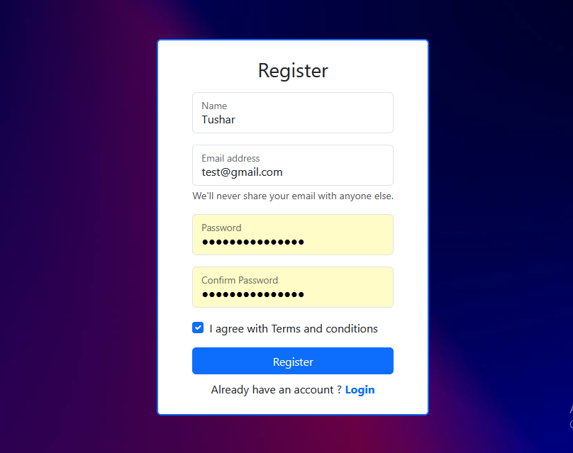
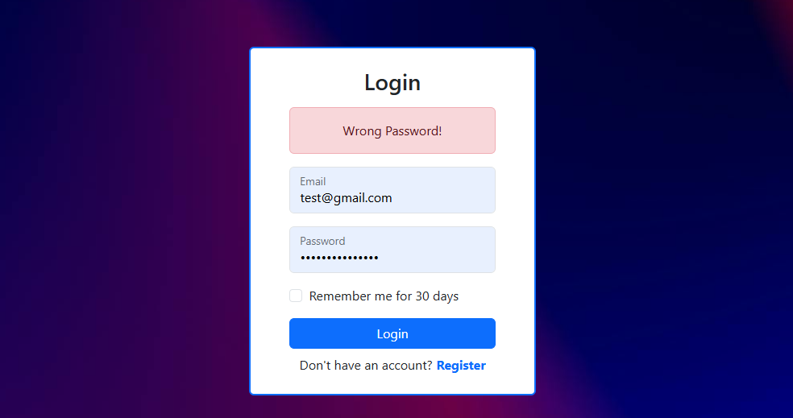
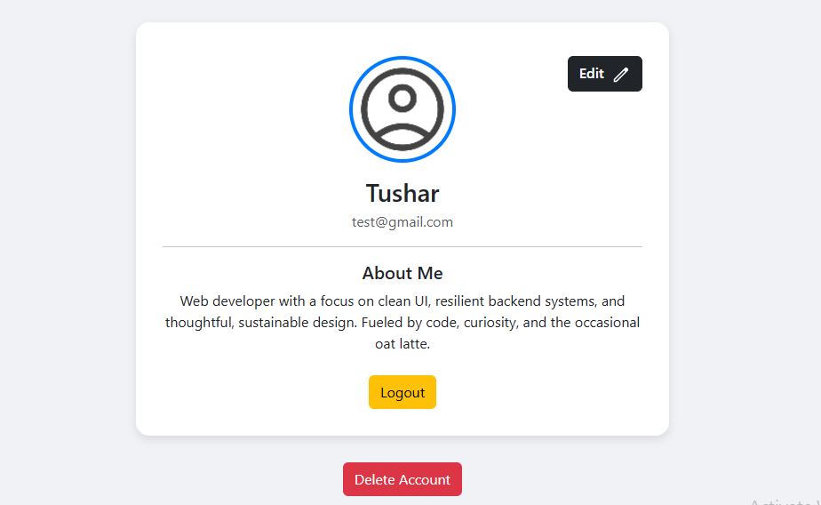
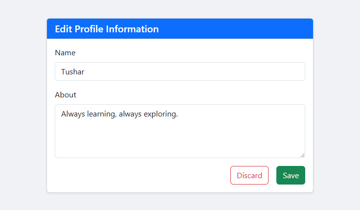

# 🔐 QuickAuth 

## - An simple Authentication System using PHP

QuickAuth is a simple and secure user authentication system built using PHP. It provides essential features such as user registration, login, profile management, and account deletion. Designed with responsiveness in mind, it works well on all device sizes.

---

## ✨ Features

- ✅ User registration and login

- ✅ "Remember Me" functionality

- ✅ Passwords and remember tokens stored securely (hashed)

- ✅ Responsive design using [Bootstrap](https://getbootstrap.com/)

- ✅ Edit profile (name, about)

- ✅ Account deletion

- ✅ Client-side form validation with JavaScript 

---

## 🛠️ Technologies Used

- PHP – Backend logic

- MySQL – Relational database

- Bootstrap – Responsive frontend design

- JavaScript – Client-side interactivity and validation

- HTML/CSS – Structure and styling

---

## 🔒 Security Overview

- Password Security: Passwords are securely hashed using PHP’s password_hash() function before being stored in the database.

- Remember Me Tokens: These tokens are also hashed before storage to prevent token leakage if the database is compromised.

- Form Validation: Input validation is performed on the client side only using JavaScript. 
  (⚠️ Note: For production environments, server-side validation is strongly recommended for better security.)

- Session Handling: User sessions are managed securely using PHP's built-in session management.

---

## ⚙️ Setup Instructions

1. Clone the repository:

    If you're using XAMPP, make sure to clone the repository inside the htdocs directory:

    git clone https://github.com/tushar-metrani/quickauth.git
    cd quickauth

2. Import the database:

    Use the provided quickauth.sql file to set up the database and required users table.

    Steps: Using phpMyAdmin

    - Open phpMyAdmin.
    - Create a new database named quickauth (or let the script create it).
    - Go to the Import tab.
    - Upload the quickauth.sql file.
    - Click Go.

3. Configure database(if neccessary):

    If your environment requires custom settings, update the database connection in _partials/db_connect.php with your own credentials:
            
        $host = "localhost";

        $username = "";   // Enter your MySQL username

        $password = "";   // Enter your MySQL password

        $db_name = "";    // Enter your database name

    ⚠️ Make sure the database exists and the credentials are correct.

4. Run the project:

    Host it locally using XAMPP, WAMP, or any PHP server.

    Navigate to http://localhost/quickauth/.

---

## 📸 Screenshots

### Register Page

### Wrong Password Error (Login)

### Dashboard Page

### Edit Profile

---

